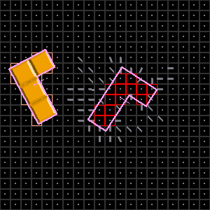
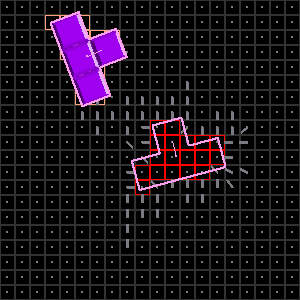
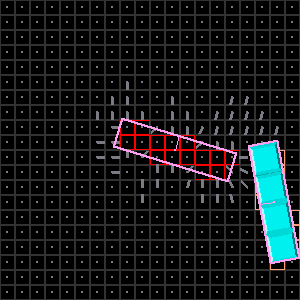
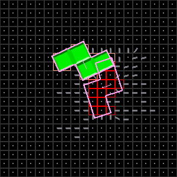

# Decentralized Control of Distributed Manipulators: An Information Diffusion Approach

  
  
  
  

In the **TestGame.py** file you can play with the different parameters.
The reproduction of the experiments can be perform through the methods *resolution_influence()* and *fault_tolerance()* on the file **Experiments.py**. After running the experiments, the results can be visualized by running the methods *figure_experiment_resolution()* and *figure_experiment_faulty()* on the file **Visuals\Figures_paper.py** which will save the pictures in the **Images\\Experiments** folder.